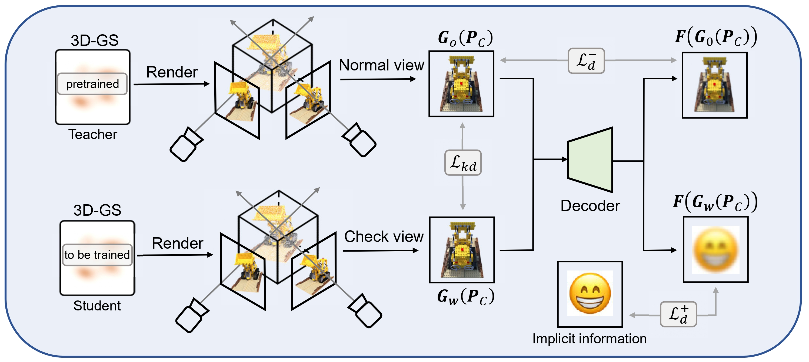

# ConcealGS: Conceal Implicit Information in 3D Gaussian Splatting


Yifeng Yang*, Hengyu Liu*, Chenxin Li†, Yining Sun, Wuyang Li, Yifan Liu, Yiyang Lin, Yixuan Yuan, Nanyang Ye (* indicates equal contribution, † indicates the project lead)<br>
| [Full Paper](https://arxiv.org/abs/2501.03605) | [code](https://github.com/zxk1212/ConcealGS) <br>
 


Abstract: *With the rapid development of 3D reconstruction technology, the widespread distribution of 3D data has become a future trend. While traditional visual data (such as images and videos) and NeRF-based formats already have mature techniques for copyright protection, steganographic techniques for the emerging 3D Gaussian Splatting (3D-GS) format have yet to be fully explored. 
To address this, we propose ConcealGS, an innovative method for embedding implicit information into 3D-GS. 
By introducing the knowledge distillation and gradient optimization strategy based on 3D-GS, ConcealGS overcomes the limitations of NeRF-based models and enhances the robustness of implicit information and the quality of 3D reconstruction. 
We evaluate ConcealGS in various potential application scenarios, and experimental results have demonstrated that ConcealGS not only successfully recovers implicit information but also has almost no impact on rendering quality, providing a new approach for embedding invisible and recoverable information into 3D models in the future.*

<section class="section" id="BibTeX">
  <div class="container is-max-desktop content">
    <h2 class="title">BibTeX</h2>
    <pre><code>@article{yang2025concealgs,
  title={ConcealGS: Concealing Invisible Copyright Information in 3D Gaussian Splatting},
  author={Yang, Yifeng and Liu, Hengyu and Li, Chenxin and Sun, Yining and Li, Wuyang and Liu, Yifan and Lin, Yiyang and Yuan, Yixuan and Ye, Nanyang},
  journal={arXiv preprint arXiv:2501.03605},
  year={2025}
}</code></pre>
  </div>
</section>

# Setup
## Environment 
Our default, provided install method is based on Conda package and environment management:
<!-- ```
conda env create --file environment.yml
conda activate feature_3dgs
``` -->

```shell
git clone https://github.com/zxk1212/ConcealGS.git
git submodule update --init --recursive

conda create --name conceal-gs python=3.8
conda activate conceal-gs
```
PyTorch (Please check your CUDA version, we used 11.8)
```shell
pip install torch==2.4.0 torchvision==0.19.0 torchaudio==2.4.0 --index-url https://download.pytorch.org/whl/cu118
```

Required packages
```shell
pip install -r requirements.txt
```

Submodules
```shell
pip install -e submodules/diff-gaussian-rasterization
pip install -e submodules/simple-knn
```

## Pretrain 
Get a set of well-trained Gaussians with the training process like [3D Gaussian Splatting](https://repo-sam.inria.fr/fungraph/3d-gaussian-splatting/)
```python
python train.py \
  -s $DATA_PATH \
  --port 6016 \
  --model_path $MODEL_PATH1 \
  --iterations 10000 \
  --resolution 4 \
  --white_background \
  --detector_lr 0.0001 \
  --eval

python render.py -m $MODEL_PATH1
python metrics.py -m $MODEL_PATH1
```

# ConcealGS
Complete running scripts is in `train_scripts/run.sh`
## Train
```python
python train_stega.py \
  -s $DATA_PATH \
  --start_checkpoint ${MODEL_PATH1}/chkpnt10000.pth \
  --watermark_path /path/to/wm/${wm_item}.png \
  --model_path $MODEL_PATH2 \
  --port 6018 \
  --resolution 4 \
  --iterations 20000 \
  --target_weight 1.0 \
  --white_background \
  --detector_lr 0.0001 \
  --eval
```
   
## Render and metric
```python
python render_stega.py \
  -m $MODEL_PATH2 \
  --watermark_path /path/to/wm/${wm_item}.png \
  --iteration 20000 \
  --skip_train

python metrics.py \
  -m $MODEL_PATH2
```
## Acknowledgement
Our repo is developed based on [3D Gaussian Splatting](https://repo-sam.inria.fr/fungraph/3d-gaussian-splatting/), [StegaNeRF](https://github.com/chenxinli001/StegaNeRF).
